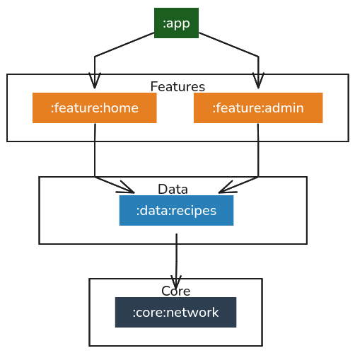

# Projet Android : Recettes UGE - ForkEat

Bienvenue dans le projet Android **ForkEat**. Cette application mobile est une plateforme communautaire dédiée à la gestion, au partage et à la monétisation de recettes culinaire, développée dans le cadre du Master Informatique à l'Université Gustave Eiffel (UGE).

## À quoi sert ce projet ?

ForkEat permet de transformer la passion pour la cuisine en une expérience sociale et rémunératrice. Les utilisateurs peuvent :
- **Découvrir** des recettes via un moteur de recherche classique ou une recherche intelligente (IA).
- **Partager** leurs propres créations avec des instructions détaillées et des photos.
- **Interagir** avec la communauté en aimant des recettes, en suivant des chefs ou en créant des variantes de plats existants.
- **Soutenir** les créateurs financièrement grâce au système de "Super Like" alimenté par un portefeuille virtuel intégré (via Stripe).

---

## Comment l'utiliser ?

### Installation
1. Clonez le dépôt.
2. Ouvrez le projet dans Android Studio.
3. Assurez-vous d'avoir accès au serveur Backend (l'URL de l'API est configurée dans `ForkEatApi`).
4. Compilez et lancez l'application sur un émulateur ou un appareil physique (Min SDK 24, et Min API 34 pour l'auth avec Google).

### Guide Rapide
1. **Navigation** : Utilisez la barre de navigation inférieure pour basculer entre l'Accueil, la Recherche et votre Profil.
2. **Authentification** : Créez un compte pour accéder aux fonctionnalités de publication, à la recherche IA, et au Wallet.
3. **Publication** : Cliquez sur le bouton "+" dans l'onglet Recherche pour ajouter une recette. Vous pouvez utiliser votre caméra pour illustrer vos plats.
4. **Wallet** : Pour recharger votre compte, accédez à "Mon Wallet" depuis votre profil et utilisez le bouton "Recharger" (Stripe Checkout).

---

## Architecture du Projet

L'application suit une architecture **MVVM (Model-View-ViewModel)** modulaire inspirée des meilleures pratiques officielles d'Android :

- **`:feature:*`** : Modules verticaux encapsulant l'interface (Compose) et la logique de présentation (ViewModel).
- **`:data:*`** : Gestion des sources de données (Retrofit, DTOs).
- **`:core:*`** : Composants partagés (Design System, Réseau).

---

## Limitations et Bugs Connus

### Limitations
- **Mode Hors-ligne** : L'application nécessite une connexion internet constante pour fonctionner. Aucun système de mise en cache locale (type Room) n'est implémenté pour le moment.
- **Paiements** : L'intégration Stripe est configurée en mode "Test". Aucune transaction réelle n'est effectuée.
- **Images** : Les images sont compressées à 1920px max avant l'envoi pour optimiser la bande passante, ce qui peut réduire la qualité sur les écrans très haute résolution.

### Bugs non résolus
- **Upload Image** : Si l'envoi d'une image échoue pendant la création d'une recette, le formulaire ne permet pas toujours de relancer uniquement l'upload sans revalider tout le texte.